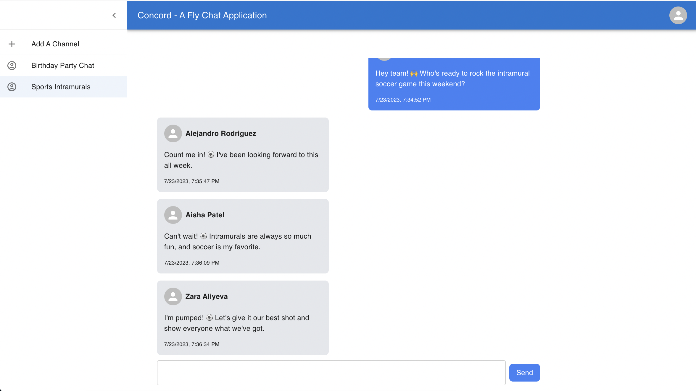

# Concord - A Realtime Chat App Built with .NET and React

Concord is a real-time chat application designed to showcase modern web technologies and foster efficient communication and collaboration among users. Developed with React, Vite, and TypeScript.
<br>


Photo: Screenshot of the main chat interface

## Table of Contents

1. [Key Features](#key-features)
2. [Tech Stack](#tech-stack)
   - [Backend](#backend)
     - [.NET 7 with Entity Framework Core](#net-7-with-entity-framework-core)
     - [SignalR](#signalr)
     - [PostgreSQL](#postgresql)
   - [Frontend](#frontend)
     - [React with Vite](#react-with-vite)
     - [TypeScript](#typescript)
     - [MaterialUI](#materialui)
     - [Tailwind CSS](#tailwind-css)
3. [Features To Be Implemented](#features-to-be-implemented)

## Key Features

Real-Time Communication:
Our chat application leverages SignalR, enabling real-time bidirectional communication between users. Users can instantly send and receive messages, fostering seamless and interactive conversations

Multiple Channels:
The app supports the creation and management of multiple channels, allowing users to engage in distinct conversations based on their interests or topics. The intuitive sidebar interface makes channel selection effortless.

Responsive Design:
Our frontend, built using React with Vite and enhanced by Tailwind CSS, offers a responsive and adaptive user interface. Users can access the application across various devices, ensuring a consistent and enjoyable experience on desktops, tablets, and mobile phones.

Material Design Principles:
The frontend UI adopts MaterialUI, a well-established and widely-used UI library based on Material Design principles. This ensures a visually appealing and consistent design language throughout the application, enhancing user familiarity and ease of use.

Type Safety with TypeScript:
TypeScript is employed in the development process, providing static typing and robust type safety. This results in fewer errors during development and better code quality, making the application more reliable and maintainable.

## Tech Stack

### Backend

#### .NET 7 with Entity Framework Core

Entity Framework Core We utilize Entity Framework Core as our ORM (Object-Relational Mapping) tool, which simplifies database interactions, enhances database performance, and ensures a smooth and hassle-free integration with our PostgreSQL cloud database.

#### SignalR

This app uses SignalR for realtime communication, SignalR enables bidirectional communication between clients and the server, eliminating the need for frequent polling and providing real-time updates to users whenever a new message is sent or received.

#### PostgreSQL

Our backend connects to a cloud-hosted PostgreSQL database, which ensures data persistence, data integrity, and easy scalability. PostgreSQL is known for its reliability and adherence to SQL standards, making it an ideal choice for data-driven applications like ours.

### Frontend

#### React with Vite

We have chosen React as the frontend framework for its component-based architecture and reactivity, allowing us to build dynamic and scalable user interfaces. Vite, a fast build tool, further enhances the development experience by providing rapid hot module replacement and instant server startup.

#### TypeScript

TypeScript is employed to bring static typing to our codebase, ensuring enhanced type safety and reduced errors during development.

#### MaterialUI

The frontend adopts MaterialUI as the primary external UI library. Following the principles of Material Design, MaterialUI provides a visually consistent and intuitive user experience. Its extensive set of components and styles accelerate development while maintaining a cohesive and professional appearance.

#### Tailwind CSS

Tailwind CSS works in harmony with MaterialUI to provide a customizable and utility-first CSS framework. Tailwind CSS facilitates effortless styling and layout adjustments, empowering us to craft unique and responsive designs that match our application's specific needs.

## Deployment

Currently, there are some issues with deployment. If you wish to test out the full application, you can clone the repository and run the application locally.

The application is set up to use a Postgres database. You will need to create an instance of a cloud Postgres database. Within the "Concord" directory, create a .env file, and add a connection string to the database. The connection string should be in the following format:

```
  DATABASE_CONNECTION_STRING="DATABASE_CONNECTION_STRING="Server=containers-us-west-000.railway.app;Port=0000;User Id=postgresuser;Password=password1;Database=database1"
```

The frontend and backend are set up to run on different ports, you will need to run the app on two separate terminals. 

With one of the terminals: 

cd into the "/Concord" directory, then run: 

```bash
  dotnet run watch --urls http://0.0.0.0:5001
```

With another terminal, cd into the "/Concord/frontend" directory, then run: 

```bash
  npm run dev

  // or 

  yarn dev
```

## Features To Be Implemented

**User Authentication and Secure Access**

Implement user authentication and authorization to ensure secure access to the application. Users will be required to register and log in to access the chat application.

**Media & files sharing**

Integrate an cloud object storage service such as AWS S3 or Azure Blob, this will allow users to share various media files seamlessly. Implement functionality for uploading, sending, and displaying images, videos, and documents within chat conversations.
